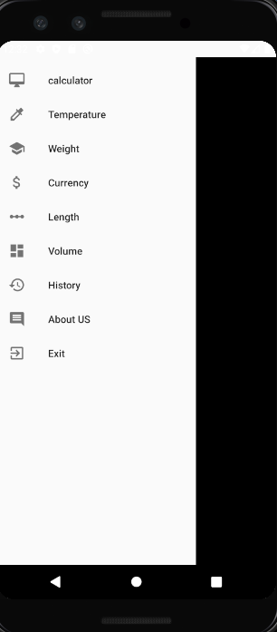
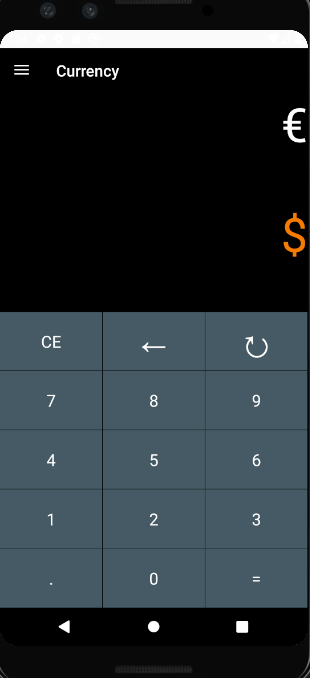
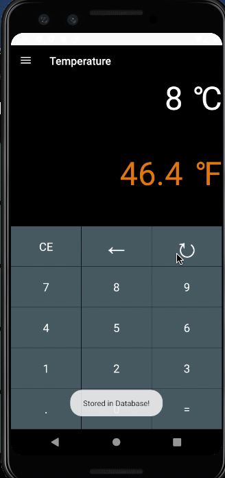
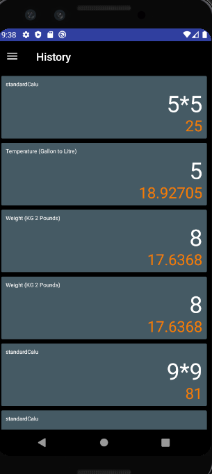
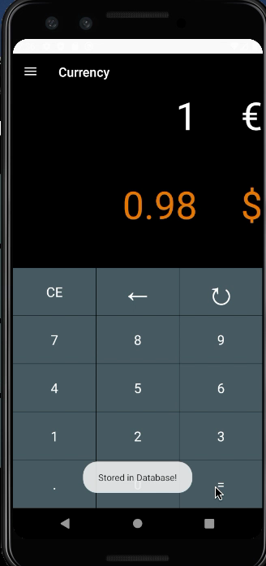
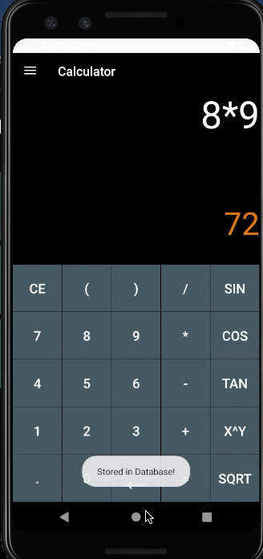
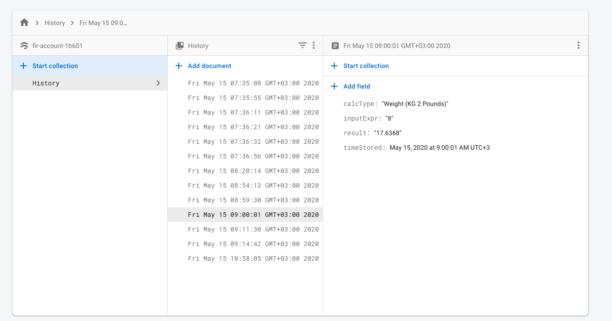

# Mobile Calculator
 Android App Scientific Calculator and Converters
 # Technology 
  Recycleview, 
  Firebase,
  Additional functionality: Converter 
  
 Result and Expression are sent to Firebase,
 History gets result from Firbase in real time
 
## [Screenshots]
  
  
 
